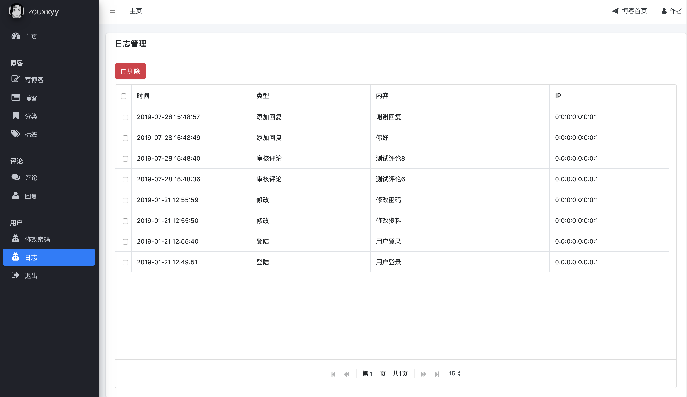
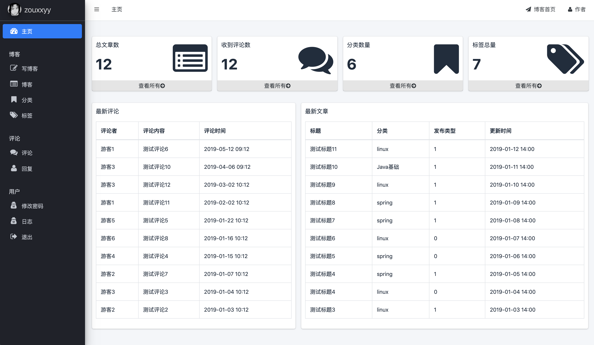

## 登陆检查

登陆检查就是添加一个拦截器：访问非登陆页时，检查登陆时存放在session中的数据。如果存在就放行，不存在就跳到登陆界面。这个之所以最后做，因为如果过早添加，调试起来太麻烦。拦截器如下：

```java
// 登陆后台管理页面的拦截器
@Component
public class AdminLoginInterceptor implements HandlerInterceptor {

    @Override
    public boolean preHandle(HttpServletRequest request, HttpServletResponse response, Object o) throws Exception {
        String uri = request.getRequestURI();
        if (uri.startsWith("/admin") && null == request.getSession().getAttribute("loginUserId")) {
            request.getSession().setAttribute("errorMsg", "请重新登陆");
            response.sendRedirect(request.getContextPath() + "/admin/login");
            return false;
        } else {
            request.getSession().removeAttribute("errorMsg");
            return true;
        }
    }
}
```
	
- 注意的是，那些网页静态数据就不要拦截了。
- 然后，安全退出功能就是把session中的数据删除，再回到登陆界面就行。

## 修改密码

就是简单的修改基本信息，以及修改密码功能。这里我添加了一个密码的二次确认。


展示如下：



## 首页设计

设计到这，首页功能应该是小菜一碟了，想添加什么到首页完全又你决定。我添加了各类统计信息，以及最新评论，最新文章。

